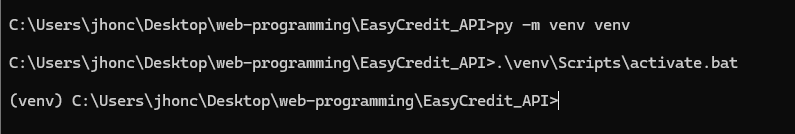

- William Steven Sosa Osorio 1151734
- Juan Diego Contreras 1152224
- Jhon Carlos Acevedo Mendoza 1151661

# Steps to clone a repository for App EasyCredit
   
1. Clone Your Repository
- Open a terminal or command prompt.     
- Navigate to the directory where you want to clone the project.


- Use the git clone command, replacing your username and your repository with your actual github credentials.


2. Activate a virtual environment(optional).



3. Install dependencies:
- Navigate to your project's directory
```
cd EasyCredit_API
``` 
- Use the pip install -r requeriments.txt command to install the dependencies listed in your project's requirements.txt file:
```
pip install -r requirements.txt
``` 


4. Verify the installation.
- To ensure all dependencies are installed correctly, you can check the install packages.

```
pip list
``` 


Note: 
- To create the file requirements.txt run the first command and to read the file in CMD run the second command.

